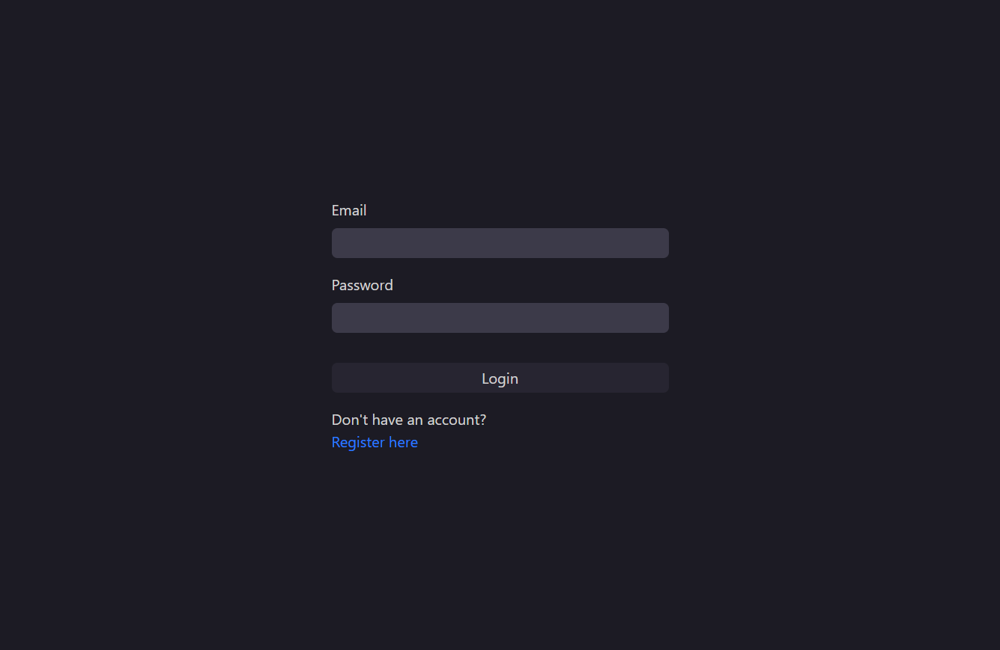
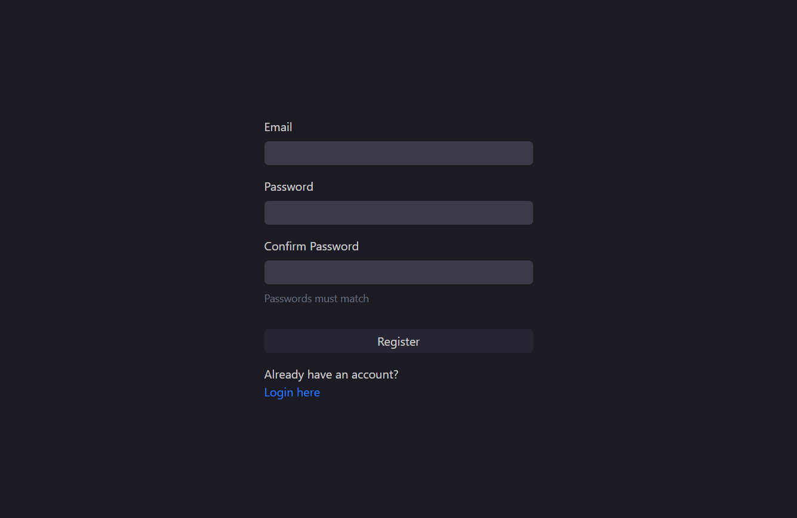
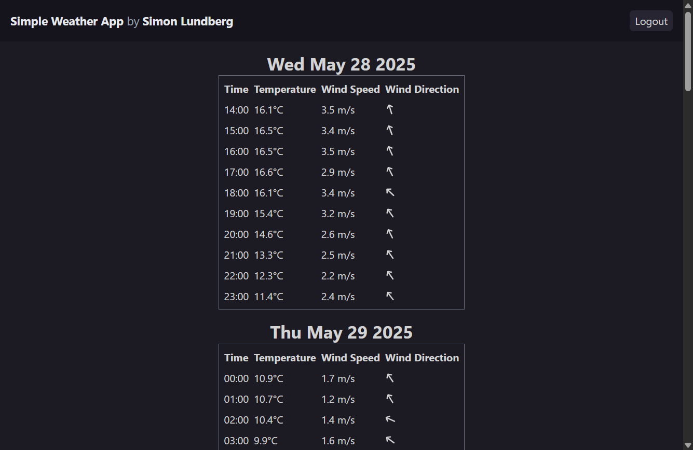

# Simple Weather Web App

A full-stack weather forecast application built with **React**, **Vite**, **TypeScript**, **Express.js**, and **PostgreSQL**. The app allows users to register, log in, and view weather forecasts for their current location, fetched from the SMHI public API.

---

## 🚀 Technologies Used

### Frontend
- [React 19](https://react.dev/)
- [TypeScript](https://www.typescriptlang.org/)
- [Vite](https://vitejs.dev/)
- [Tailwind CSS](https://tailwindcss.com/)
- [React Query](https://tanstack.com/query/latest)
- [Axios](https://axios-http.com/)
- [React Router v7](https://reactrouter.com/en/main)
- [React Icons](https://react-icons.github.io/react-icons/)

### Backend
- [Express.js](https://expressjs.com/)
- [PostgreSQL](https://www.postgresql.org/)
- [jsonwebtoken](https://github.com/auth0/node-jsonwebtoken)
- [dotenv](https://github.com/motdotla/dotenv)
- [pg](https://node-postgres.com/)
- [cookie-parser](https://github.com/expressjs/cookie-parser)
- [CORS](https://github.com/expressjs/cors)

### DevOps
- [Docker](https://www.docker.com/)
- [docker-compose](https://docs.docker.com/compose/)

---

## 🖼️ Screenshots

**Login Page**


**Register Page**


**Weather Forecast Table**


---

## ⚙️ Setup & Running Locally

### Prerequisites

- [Docker](https://www.docker.com/) & [docker-compose](https://docs.docker.com/compose/)
- [Node.js](https://nodejs.org/) (for local development without Docker)

### 1. Clone the repository

```sh
git clone https://github.com/lundbergsimon/weather-web-app.git
cd weather-web-app
```

### 2. Environment Variables

Create a `.env` file in the `backend/` directory:

```
JWT_SECRET=your_super_secret_key
```

> _You can change `JWT_SECRET` to any strong secret string._

### 3. Run with Docker

```sh
docker-compose up --build
```

- Frontend: [http://localhost:5173](http://localhost:5173)
- Backend API: [http://localhost:8000/api/v1](http://localhost:8000/api/v1)
- PostgreSQL: localhost:5431

### 4. Run Locally (without Docker)

#### Backend

```sh
cd backend
npm install
npm run dev
```

#### Frontend

```sh
cd frontend
npm install
npm run dev
```

---

## ✨ Features

- User registration and login with JWT authentication
- Secure refresh token flow with httpOnly cookies
- Weather forecast for your current geolocation (using browser geolocation API)
- Responsive UI with Tailwind CSS
- Logout and error popups for user feedback

---

## 🛠️ Future Improvements

- **Password Hashing:** Store hashed passwords instead of plain text for better security.
- **Profile Management:** Allow users to update their email/password.
- **Unit & Integration Tests:** Add automated tests for both frontend and backend.
- **Better Error Handling:** Improve error messages and validation.
- **Forecast Data:** Show additional forecast details, such as weather conditions, and include an option to select a location.
- **Styling:** Improve CSS styling and add animations.
- **Accessibility:** Improve accessibility for screen readers and keyboard navigation.

---

## 📄 License

MIT

---

## 👤 Author

Simon Lundberg

---

> _Feel free to open issues or submit pull requests!_